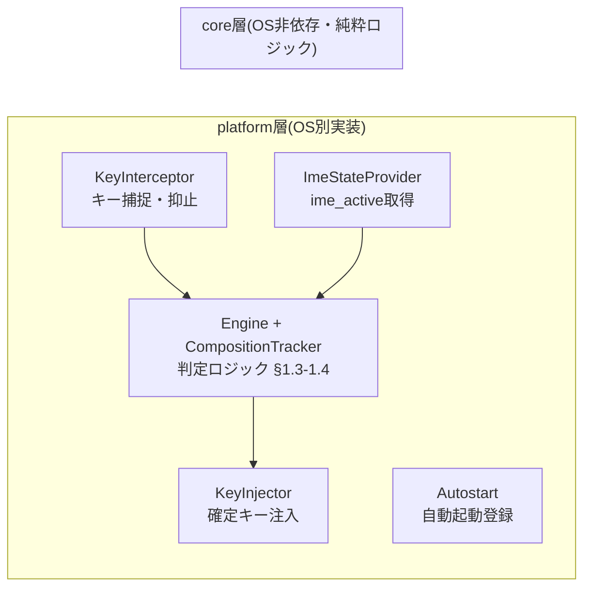

# CLIME — Caps Lock IME commit

エンターキーがメッセージの送信に割り当てられがちなので, IME確定をエンターキーでやるとよく誤送信する. そこでCaps LockにIME確定を割り当てるキーバインドツールを作る.

- 対応OS: Windows / macOS / Linux
- 常駐型CLIツール(v1はトレイアイコンなし)。OSログイン時に自動起動する。
- 本ドキュメントが仕様の単一情報源(single source of truth)。実装エージェント向けの作業手順は [AGENTS.md](AGENTS.md) を参照。

---

## 1. 動作仕様

### 1.1 基本動作

**物理 Caps Lock キー**(スキャンコード/HIDコード基準。JIS/US配列の論理割り当てに依存しない)を押したとき:

| IME の状態 | Caps Lock 押下時の動作 |
|---|---|
| 変換中(プリエディットあり) | **確定キー(既定: Enter)を注入** → IMEが消費して確定。アプリにEnterは届かない |
| IMEオンだが非変換中 | 何もしない(`idle_action` で変更可) |
| IMEオフ / 状態不明 | 何もしない(安全側に倒す) |

補足仕様:

- Caps Lock 本来のトグル動作は**常に抑止**する(押下・解放とも)。
- **Shift + Caps Lock** は本来の Caps Lock トグルとしてパススルーする(`shift_passthrough = true` 既定。macOSはベストエフォート、§3.2参照)。
- Shift 以外の修飾キー(Ctrl / Alt / Win / Cmd)が押下されている間の Caps Lock は**何もしない**(押下中の修飾キーと注入キーの合成による予期しない動作を防ぐ)。
- キーリピートは無視する(最初の keydown のみ処理)。
- 自前で注入したキーイベントは必ず識別マーカーを付け、自分のフック/トラッカーが再処理しないこと(ループ防止)。

### 1.2 フェイルセーフ原則(最重要)

> **確定キーを注入してよいのは「変換中」と確信できるときだけ。不確実なら何もしない。**

- 偽陰性(変換中なのに確定されない)= ユーザーがEnterを押せばよいだけ。軽微。
- 偽陽性(非変換中に確定キーが注入される)= **誤送信そのもの**。このツールの存在意義を破壊する。絶対に避ける。

多層防御として、確定キーには利用可能な環境で Ctrl+M を用いる(§1.3)。Ctrl+M は多くのチャットアプリで未割り当てのため、万一偽陽性が起きても誤送信になりにくい。ただしターミナルでは Ctrl+M は CR(Enter と同一)であり無害化されない。したがって **Ctrl+M はあくまで保険であり、「変換中と確信できるときだけ注入する」ゲートは常に維持する**。

### 1.3 判定ロジック

2つの情報源を組み合わせる。

1. **`ime_active`** — IMEがオン(日本語入力モード)か。OSのAPIで取得(§3)。値は `Yes / No / Unknown`。
2. **ヒューリスティック変換状態トラッカー** — キー・マウスイベントの観測から「変換中か」を推定する状態機械(全OS共通のコアロジック)。

| `ime_active` | トラッカー判定 | Caps Lock 押下時の動作 |
|---|---|---|
| Yes | 変換中 | 確定キー注入 |
| Yes | 非変換中 | `idle_action` |
| No / Unknown | (問わず) | `idle_action` |

#### 確定キーの解決(`commit_key = "auto"`)

注入する確定キーは2種類:

- **Enter** — 全IME・全キーマップで無条件に確定する(普遍的)。偽陽性時は誤送信に直結。
- **Ctrl+M** — MS-IME系の既定キーマップで確定。多くのチャットアプリで未割り当てのため偽陽性時の被害が小さい。ただしIMEのキーマップ依存。

既定の `auto` では、トリガー押下ごとにアクティブIMEの識別子(`ime_id`、取得方法は§3の各OS欄)を以下の許可リストと照合し、**既定キーマップで「Ctrl+M = 確定」を確認済みのIMEに限り** Ctrl+M を使う。それ以外・識別不能(`None`)時は Enter に落とす。

| OS | アクティブIME | 注入キー |
|---|---|---|
| Windows | MS-IME / Google 日本語入力 | Ctrl+M |
| Linux | mozc(fcitx5 / ibus) | Ctrl+M |
| macOS | (当面なし。標準IM・Google 日本語入力の Ctrl+M 既定対応が未検証のため) | — |
| 全OS | 上記以外・識別不能 | Enter |

- `commit_key` に `enter` / `ctrl_m` が明示されていれば解決を行わず常にその値を使う(IMEのキー設定をカスタマイズしている環境向けの逃げ道)。
- 許可リストは「IMEが既定キーマップのまま」であることを前提とする(§6)。
- 許可リストと解決ロジックは core 層に置き、ユニットテスト対象とする。
- Ctrl+M の注入は Ctrl down → M down → M up → Ctrl up の一連イベント(すべてマーカー付き)。

### 1.4 変換状態トラッカー(状態機械)

状態: `Idle` / `Composing`。全OSで同一実装(コアクレート内、純粋ロジック、ユニットテスト必須)。

| 現在状態 | 観測イベント | 遷移先 |
|---|---|---|
| Idle | 印字キー押下 かつ `ime_active == Yes` | Composing |
| Composing | Enter / Escape / Ctrl+M 押下(実キー・注入とも) | Idle |
| Composing | マウスクリック(どのボタンでも) | Idle |
| Composing | フォアグラウンド(フォーカス)変更 ※検出可能なOSのみ | Idle |
| Composing | `ime_active` が Yes 以外に変化 | Idle |
| Composing | 最終キー入力から `heuristic_timeout_secs` 経過 | Idle |

- マウスクリック・フォーカス変更によるリセットは偽陽性防止のため **v1 必須**(クリックで実際の変換は確定/破棄されるが、トラッカーだけ Composing のまま残ると危険なため)。
- 注入した確定キー(マーカー付き)は「確定」としてのみ扱う。特に Ctrl+M 注入に含まれる M を印字キー(Composing 開始条件)として扱ってはならない。
- 物理 Ctrl+M の観測には、各OSのインターセプタで修飾キー状態の追跡が必要(§3)。
- タイムアウト既定 30 秒。変換途中で長考すると確定できなくなるが、安全側の割り切り。
- 既知の限界: IME側の自動確定(句読点確定など)や予測入力の確定はトラッカーから見えない → Composing が過剰に残り得るが、上記リセット条件で緩和する。精密検出は v2(§7)。

### 1.5 設定ファイル

TOML。パスは [directories](https://crates.io/crates/directories) クレート準拠:

- Windows: `%APPDATA%\clime\config.toml`
- macOS: `~/Library/Application Support/clime/config.toml`
- Linux: `~/.config/clime/config.toml`

```toml
[general]
idle_action = "none"          # none | capslock (非変換中にCaps Lock押下時の動作)
shift_passthrough = true      # Shift+CapsLockで本来のCapsLockトグル
commit_key = "auto"           # auto | enter | ctrl_m(autoの解決規則は§1.3)
log_level = "info"            # error | warn | info | debug | trace

[detection]
heuristic_timeout_secs = 30   # Composing状態の有効期限
```

ファイルが無ければ既定値で動作する(初回 `run` 時に既定値で生成)。

### 1.6 CLI

バイナリ名: `clime`

| コマンド | 動作 |
|---|---|
| `clime run` | フォアグラウンドで常駐実行(ログは stderr、`RUST_LOG` で上書き可) |
| `clime install-autostart` | ログイン時自動起動を登録(§3 各OS欄) |
| `clime uninstall-autostart` | 自動起動を解除 |
| `clime doctor` | 権限・依存・IME検出可否を診断して人間向けに表示。異常時は終了コード非0 |
| `clime --version` | バージョン表示 |

終了時(SIGTERM / Ctrl+C / コンソールクローズ)は必ずクリーンアップする(フック解除、macOSの hidutil リマップ復元、uinputデバイス破棄)。

---

## 2. アーキテクチャ



### 2.1 ディレクトリ構成

```
clime/
├── Cargo.toml
├── src/
│   ├── main.rs              # CLIエントリ (clap)
│   ├── config.rs            # 設定ロード (serde + toml)
│   ├── core/
│   │   ├── mod.rs           # Engine: 観測イベント → Decision
│   │   └── tracker.rs       # CompositionTracker (§1.4 状態機械)
│   └── platform/
│       ├── mod.rs           # トレイト定義 + OS別実装のディスパッチ
│       ├── windows/         # #[cfg(target_os = "windows")]
│       ├── macos/           # #[cfg(target_os = "macos")]
│       └── linux/           # #[cfg(target_os = "linux")]
├── tests/                   # coreの統合テスト(モックbackend使用)
└── .github/workflows/       # ci.yml, release.yml
```

### 2.2 platform トレイト(概形)

```rust
pub enum ImeGuess { Yes, No, Unknown }

pub enum CommitKey { Enter, CtrlM }

pub struct ImeSnapshot {
    pub active: ImeGuess,
    pub ime_id: Option<String>,    // 例: TISソースID / TSFプロファイル識別子 / "mozc"(§1.3)
}

pub enum ObservedEvent {           // Interceptor → Engine への観測イベント
    TriggerKeyDown { shift: bool, other_mods: bool }, // 物理CapsLock(other_mods: Ctrl/Alt/Win/Cmd)
    PrintableKeyDown,
    CommitLikeKeyDown,             // Enter / Escape / 物理Ctrl+M
    MouseClick,
    FocusChanged,
}

pub enum Decision { InjectCommitKey(CommitKey), PassThroughCapsLock, Suppress, Ignore }

pub trait KeyInterceptor {         // イベントループを所有し、観測イベントをEngineへ渡す
    fn run(&mut self, engine: &mut Engine, injector: &mut dyn KeyInjector) -> anyhow::Result<()>;
}
pub trait KeyInjector {
    fn inject_commit_key(&mut self, key: CommitKey) -> anyhow::Result<()>;
    fn inject_capslock(&mut self) -> anyhow::Result<()>;
}
pub trait ImeStateProvider {
    fn snapshot(&mut self) -> ImeSnapshot;    // ime_active + ime_id を一括取得
}
pub trait Autostart {
    fn install(&self) -> anyhow::Result<()>;
    fn uninstall(&self) -> anyhow::Result<()>;
}
```

- `Engine`(core)は OS API を一切呼ばない。テストではモックの Interceptor/Provider を注入する。
- `unsafe` は platform 層のみ許可。全 `unsafe` ブロックに安全性根拠のコメント必須。

---

## 3. OS別実装方式

### 3.1 Windows

| 項目 | 方式 |
|---|---|
| キー捕捉・抑止 | `SetWindowsHookExW(WH_KEYBOARD_LL)`。**スキャンコード 0x3A** で物理CapsLockを識別(JIS配列ではvkCodeが `VK_OEM_ATTN`(0xF0, 英数)になるためvk判定は不可)。リピート状態もCapsLock専用のscanCode状態で追跡し、vkCodeに依存しない。戻り値1で抑止 |
| マウス観測 | `WH_MOUSE_LL`(クリックのみ、Composingリセット用) |
| フォーカス観測 | `SetWinEventHook(EVENT_SYSTEM_FOREGROUND)` |
| `ime_active` | `GetForegroundWindow()` のGUIスレッドから `GetGUIThreadInfo` で実際のキーボードフォーカス窓(`hwndFocus`)を解決し、その窓に対する `ImmGetDefaultIMEWnd` へ `WM_IME_CONTROL` / `IMC_GETOPENSTATUS (0x0005)` を `SendMessageTimeoutW` で送信。フォーカス窓を取得できない場合は前面トップレベル窓へフォールバック。解決中に前面窓が変化・応答なし・IMEウィンドウなし → `Unknown` |
| `ime_id` | TSF `ITfInputProcessorProfileMgr::GetActiveProfile` でアクティブ入力プロファイルを取得し、MS-IME / Google 日本語入力の CLSID と照合(**要検証**: 呼び出し方法と各CLSID値)。取得不能は `None`(→ Enter に解決) |
| 確定キー注入 | `SendInput`(VK_RETURN、または VK_CONTROL + `M` の一連)。`dwExtraInfo` に自前マーカー。フック側は `LLKHF_INJECTED` + マーカーで自イベントを無視 |
| 自動起動 | `HKCU\Software\Microsoft\Windows\CurrentVersion\Run` に値 `CLIME` = `"<exe path>" run` |
| 権限 | 管理者権限不要。UACセキュアデスクトップではフックが効かないが実害なし |
| 注意 | フックコールバック内は最小処理(重い処理はチャネルでワーカーへ)。フックはメッセージループ必須 |

既知の制約: UWP系アプリ等で `IMC_GETOPENSTATUS` が取れず `Unknown` → そのアプリではCaps Lockが無反応になる(安全側)。

### 3.2 macOS

| 項目 | 方式 |
|---|---|
| キー捕捉・抑止 | 起動時に `hidutil property --set` の UserKeyMapping で **CapsLock(0x700000039) → F18(0x70000006D)** にリマップし、`CGEventTap` で F18 keydown を捕捉・抑止。終了時に必ずリマップ復元 |
| マウス観測 | 同じ CGEventTap でマウスダウンを listen-only 監視 |
| `ime_active` | `TISCopyCurrentKeyboardInputSource` の input source ID に `Japanese` を含むか(C FFIで宣言)。変更検知はトリガー押下時に都度取得で十分 |
| `ime_id` | 上記 input source ID をそのまま利用。ただし macOS の許可リストは当面空のため `auto` では常に Enter に解決(§1.3)。ログと将来の拡張用に取得だけ行う |
| 確定キー注入 | `CGEventCreateKeyboardEvent`(kVK_Return = 36。`commit_key = "ctrl_m"` 明示時は kVK_ANSI_M = 46 + Control フラグ)→ `CGEventPost`。`CGEventSetIntegerValueField(kCGEventSourceUserData, マーカー)` で自イベント識別 |
| 自動起動 | `~/Library/LaunchAgents/dev.clime.agent.plist`(RunAtLoad, KeepAlive)。`launchctl bootstrap/bootout` で登録・解除 |
| 権限 | **入力監視(Input Monitoring)** と **アクセシビリティ** をTCCで手動許可。初回は `clime run` を手動実行して許可を済ませてから `install-autostart` する運用。バイナリのパスを変えると再許可が必要 |
| Shift+パススルー | CapsLockトグルのプログラム的切替は `IOHIDSetModifierLockState`(準private API)が必要 → **v1はベストエフォート**。不可なら `shift_passthrough` はmacOSで未サポートとしてdoctorで通知 |

既知の制約: ターミナルの「Secure Keyboard Entry」有効時はイベントタップが無効化される。hidutilリマップはクラッシュ時に残留し得る → `clime doctor` に復元機能(`hidutil property --set '{"UserKeyMapping":[]}'` 相当)を持たせ、READMEにも手動復元コマンドを記載する。

### 3.3 Linux

| 項目 | 方式 |
|---|---|
| キー捕捉 | evdev(`/dev/input/event*`)を**読み取り専用**で監視(EVIOCGRABしない)。`KEY_CAPSLOCK (58)` で識別。キーボードのホットプラグに追従(inotify or 定期再列挙) |
| CapsLockトグル抑止 | XKBオプション `caps:none` で無効化。`install-autostart` 時に環境を判別して自動設定を試みる: X11 → `setxkbmap -option caps:none` / GNOME → `gsettings set org.gnome.desktop.input-sources xkb-options "['caps:none']"` / その他 → doctorで手順を案内 |
| マウス観測 | evdevのマウスデバイス(BTN_LEFT等) |
| `ime_active` | fcitx5: zbus で `org.fcitx.Fcitx5` の `Controller1.State()` を照会(**要検証**: 戻り値の意味) / ibus: グローバルエンジン名に `mozc` 等を含むか / どちらも不在 → `Unknown` |
| `ime_id` | fcitx5: `Controller1.CurrentInputMethod()` / ibus: グローバルエンジン名。`mozc` 系なら Ctrl+M に解決(§1.3)。取得不能は `None` |
| 確定キー注入 | uinput 仮想キーボード(`evdev` クレートの VirtualDevice)で KEY_ENTER、または KEY_LEFTCTRL + KEY_M の一連。自デバイス由来のイベントは監視対象から除外 |
| 自動起動 | systemd user unit(`~/.config/systemd/user/clime.service`、`systemctl --user enable`)。systemd不在環境はXDG autostart(.desktop)にフォールバック |
| 権限 | `/dev/input` 読み取り: `input` グループ所属。`/dev/uinput`: udevルールが必要。`clime doctor` が不足を検出して設定手順(usermod / udev rule)を表示 |

既知の制約: Wayland/X11ともevdev+uinputで動作するが、XKB設定はデスクトップ環境ごとに手段が異なる(自動設定できない環境はドキュメントで案内)。フォーカス変更検出は困難なため、マウス・タイムアウトによるリセットに依存。

---

## 4. テックスタック

**言語: Rust(stable)、単一バイナリ。**

選定理由: 3OSの低レベルAPI(フック/イベントタップ/evdev)へのFFIが安全に書ける・ランタイム依存なしの単一バイナリで常駐と自動起動が単純・コアロジックを純粋関数化してCIでテスト可能。

| 用途 | クレート |
|---|---|
| CLI | `clap` (derive) |
| 設定 | `serde` + `toml` + `directories` |
| ログ | `log` + `env_logger` |
| エラー | `anyhow` + `thiserror` |
| Windows API | `windows`(windows-rs) |
| macOS | `core-graphics`, `core-foundation`(TIS等は手書き `extern "C"`) |
| Linux | `evdev`(uinput含む), `zbus`(fcitx5/ibus) |

却下した代替案:

| 案 | 却下理由 |
|---|---|
| AutoHotkey / Karabiner / keyd の設定配布 | 単一OS限定。3OS統一の配布・自動起動ができない |
| Electron / Tauri 常駐アプリ | v1にGUI不要。低レベルフックはどのみちネイティブ実装が必要 |
| Go | macOSイベントタップ等のcgo境界が煩雑 |
| OSごとに別言語・別コードベース | コア判定ロジック(§1.3-1.4)を3重実装・3重テストすることになる |

---

## 5. 開発手順

### 5.1 前提ツール

- 共通: Rust stable(rustup)、git
- Windows: Visual Studio Build Tools(MSVC)
- macOS: Xcode Command Line Tools
- Linux: 特別な依存なし(evdev/zbusはpure Rust)。実行時テストに `input` グループと udev ルール(§3.3)

### 5.2 日常コマンド

```sh
cargo build                                  # ビルド
RUST_LOG=debug cargo run -- run              # デバッグ実行(フォアグラウンド)
cargo test                                   # ユニット+統合テスト(core中心)
cargo clippy --all-targets -- -D warnings    # リント(警告ゼロ必須)
cargo fmt --all -- --check                   # フォーマット検査
```

クロスターゲット型検査(ホストOS以外のコンパイルエラーを早期検出):

```sh
rustup target add x86_64-pc-windows-msvc aarch64-apple-darwin x86_64-unknown-linux-gnu
cargo check --target x86_64-pc-windows-msvc
cargo check --target aarch64-apple-darwin
cargo check --target x86_64-unknown-linux-gnu
```

### 5.3 CI / リリース

- `ci.yml`: push/PR で `windows-latest / macos-latest / ubuntu-latest` のマトリクス。fmt → clippy → test → build。
- `release.yml`: タグ `v*` で各OSバイナリ(win x64 / mac universal / linux x64)をGitHub Releasesへ添付。

### 5.4 マイルストーン

実装は [AGENTS.md](AGENTS.md) のプロンプトに従い、1マイルストーン = 1ブランチ/PR で進める。

| # | 内容 | 完了条件(共通: §5.2 全コマンド成功) |
|---|---|---|
| M0 | スキャフォールド: CLI骨格・config・ログ・CI | `clime --version` / `doctor`(スタブ)が3OSでcheck通過 |
| M1 | core層: Engine + CompositionTracker + 確定キー解決 + トレイト + モックテスト | §1.3(判定表・確定キー解決)と §1.4 の全遷移をテストで網羅 |
| M2 | Windowsバックエンド + 自動起動 | 手動テスト表(§6)のWindows列が通る |
| M3 | macOSバックエンド + 自動起動 | 同 macOS列 |
| M4 | Linuxバックエンド + 自動起動 | 同 Linux列 |
| M5 | release.yml・doctor仕上げ・ドキュメント整備 | タグからリリース成果物が生成される |

### 5.5 手動テスト(人間が実機で実施)

自動化不能なIME実動作の確認。各OSで以下をチェックリストとして実施:

| # | 手順 | 期待結果 |
|---|---|---|
| T1 | メモ帳等で日本語変換中に Caps Lock | 確定される。確定キーはアプリに届かない(改行等が起きない) |
| T2 | 変換確定直後にもう一度 Caps Lock | **何も起きない**(誤Enterなし) |
| T3 | IMEオフ(英数)でテキスト入力後 Caps Lock | 何も起きない。caps状態も変化しない |
| T4 | 変換中にマウスで別の場所をクリック → Caps Lock | 何も起きない(トラッカーがリセット済み) |
| T5 | Shift + Caps Lock | 本来のcapsトグルが効く(macOSは§3.2の範囲で) |
| T6 | チャットアプリ(Slack/Discord等)で変換→Caps Lock確定→Enter | 確定と送信が意図通り分離される |
| T7 | `clime install-autostart` → 再ログイン | 自動起動している。`uninstall-autostart` で解除される |
| T8 | プロセスをkill → キーボードが完全に正常に戻る | 残留リマップ・フックなし(macOSは `doctor` で復元確認) |
| T9 | `RUST_LOG=debug` で変換中に Caps Lock(MS-IME / Google日本語入力 / mozc 環境と、許可リスト外のIME環境) | ログ上の解決キーが §1.3 の許可リスト通り(前者は Ctrl+M、後者と macOS は Enter)。いずれも確定に成功する |

対象IME: MS-IME / Google日本語入力(Windows)、日本語IM・Google日本語入力(macOS)、fcitx5-mozc / ibus-mozc(Linux)。

---

## 6. リスク・既知の制約

- ヒューリスティック検出は原理的に完全ではない。§1.2の原則により「効かない」方向に倒す。精密検出(下記)はv2。
- `commit_key = "auto"` の許可リスト(§1.3)は、IMEが**既定キーマップのまま**であることを前提とする。キー設定をカスタマイズした環境では `commit_key` の明示指定が必要。また Ctrl+M もターミナルでは CR(Enter と同義)なので、偽陽性対策の主軸はあくまで変換中ゲートである。
- Windows: UWP等で `ime_active` が取れないアプリでは無反応(安全側)。
- macOS: TCC許可の手動操作が必要。Secure Keyboard Entry中は無効。クラッシュ時のhidutil残留は `doctor` で復元。
- Linux: XKB設定の自動化はDE依存。uinput権限のセットアップが必要。
- リモートデスクトップ・VM内では入力経路が異なり動作保証外。

## 7. v2 候補(v1では実装しない)

- 変換状態の精密検出(Windows: UI Automation の composition イベント / IMM候補ウィンドウ検出、macOS: AX API)
- トレイアイコン・GUI設定
- Ctrl+M 許可リストの拡充(macOS標準IM・Google 日本語入力(macOS)・ATOK の実機検証後に追加)
- アプリ別プロファイル
- インストーラ(MSI / pkg / deb・rpm)
